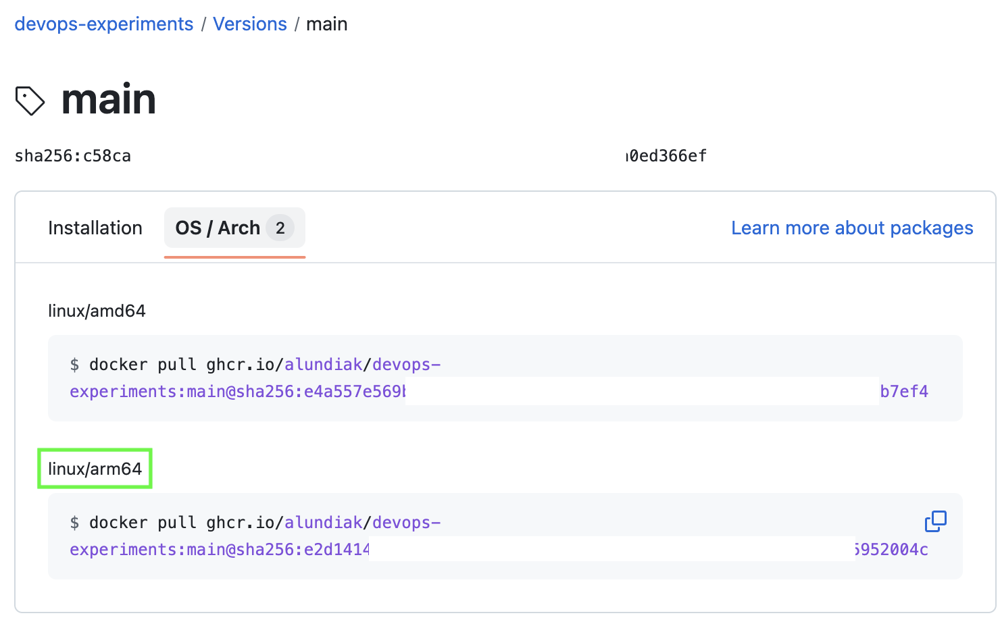
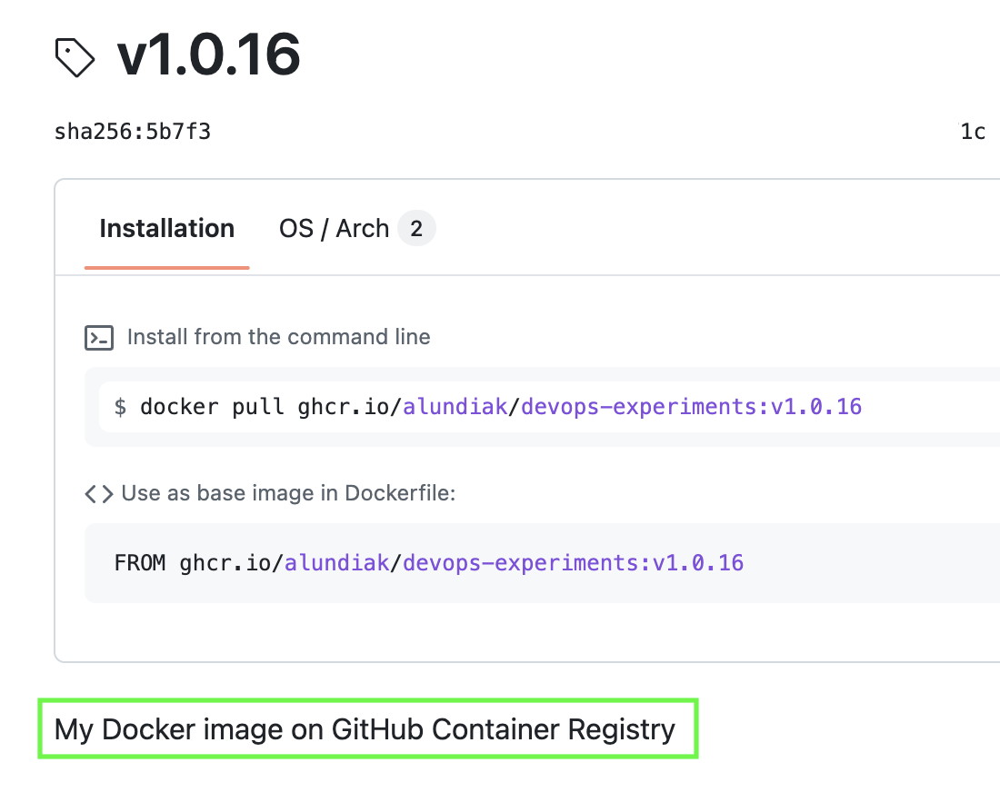
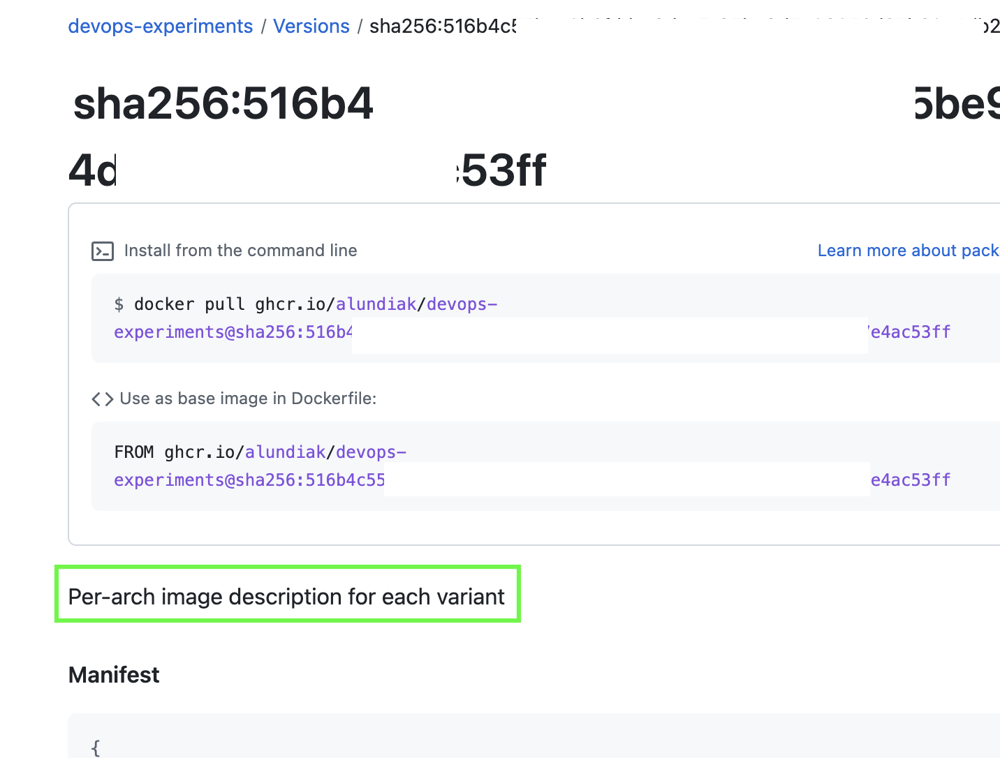

# DevOps Experiments

Various DevOps related code experiments and info needed to grasp main DevOps techniques.

## Docker

Build Docker Image and Publish to GitHub Container Registry

There was/is an [issue](https://github.com/orgs/community/discussions/45969) w `unknown/unknown` in OS/Arch tab, but it seems to be possible to avoid it.

So this is docker image pushed as from `ghcr.io` and shown as package on GitHub with proper arch info.

Next issue was to "fight" two different descriptions for package as main and per-arch packages descriptions. Still not sure how to create separate description for different archs.

Documentation:

- https://docs.github.com/en/packages/working-with-a-github-packages-registry/working-with-the-container-registry

## Kubernetes

TBD

## Helm

TBD

## Terraform

TBD
