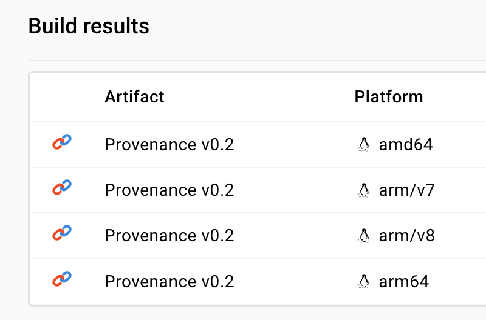

Usage of my custom Docker image on GitHub Container Registry
===

## `docker build` a local image-wrapper

- `cd my-custom-image-using-another-image`
- `docker build -t my-custom-image-nodejs-wrapper .`

## `docker buildx`

Building with `docker buildx` gives such results:

- `docker buildx build --platform=linux/amd64,linux/arm64,linux/arm/v7,linux/arm/v8 -t my-custom-image-nodejs-wrapper .`

;

[docker buildx](https://docs.docker.com/engine/reference/commandline/buildx_build/#platform) Docs.

## `docker pull` or Dockerfile

- `docker pull ghcr.io/alundiak/devops-experiments:main`
- `FROM ghcr.io/alundiak/devops-experiments:main` in Dockerfile

This doesn't work yet:

- `docker pull --platform linux/arm64 ghcr.io/alundiak/devops-experiments:main`
- `FROM --platform=linux/arm64 ghcr.io/alundiak/devops-experiments:main` in Dockerfile

## `docker run`

- `docker run --name=MyNodeJsWrapperContainer -p 3001:3001 -d my-custom-image-nodejs-wrapper`
